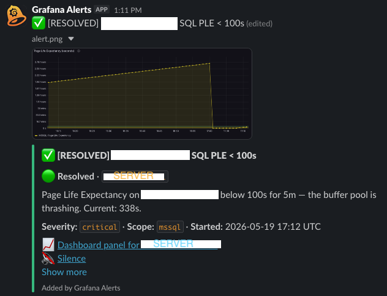

# grafana-slack-bridge

A small webhook receiver that turns Grafana alert notifications into **in-place updates** in Slack — one message per alert group, mutating through firing → resolved instead of spamming a new message on every state change — and adds back the pieces of Grafana OnCall people miss most: **duration-based escalation** and **Acknowledge / Silence buttons**.

[](LICENSE)



## The problem

Grafana deprecated the OSS OnCall IRM. OnCall had several nice abilities the native Grafana Slack alerting lacks. Grafana's native Slack contact point only calls `chat.postMessage`: every state transition — firing, more hosts joining the group, resolved, repeat-interval re-notification — produces a brand-new Slack message, and there's no escalation, no acknowledgement, and no way to silence from Slack.

## What this does

It sits between Grafana and Slack. Grafana sends webhook payloads here; the bridge:

1. Extracts the alert `groupKey` from the payload.
2. On first firing → posts the alert with `chat.postMessage` and remembers `(groupKey → channel, ts)`. If a panel image is rendered, it's attached as a **threaded reply** so the parent message can still carry buttons.
3. On subsequent state changes for the same `groupKey` → calls `chat.update`, mutating the original message with new content + a colour-coded sidebar.
4. If a critical stays **firing and unresolved past a threshold** → posts a one-time, mention-tagged **escalation** message (a `chat.update` never re-notifies, so a long-running alert otherwise sinks unnoticed).
5. Renders **Acknowledge / Silence** buttons on the message. Clicks arrive over **Socket Mode** (an outbound WebSocket — no public ingress needed).

Result: one tidy Slack message per alert group through its whole lifecycle, that escalates if ignored and can be acknowledged or silenced with a click.

## Features

- **In-place message updates** via Slack `chat.update` — one message per alert group, not one per state change.
- **Escalation** — a configurable severity still firing after N hours re-posts a fresh `@here`/`@channel` message (in-channel by default, or to a dedicated channel), and reverts to resolved styling when it clears.
- **Acknowledge / Silence buttons** (via Slack Socket Mode — no inbound ingress). **Ack** halts escalation and marks the message; **Silence** creates a real Grafana silence (1h/4h/24h) scoped to the alert.
- **Multi-channel routing** — append `?channel=Cxxxxx` to the webhook URL per Grafana contact point; one bridge process serves N channels.
- **Optional image rendering** — the bridge can call Grafana `/render` itself and attach the PNG as a threaded reply, bypassing Grafana's screenshot quirks.
- **Severity-coloured sidebars** — critical / warning / info / resolved map to red / yellow / blue / green.
- **Per-group serialization** — survives Grafana HA double-delivery without duplicate messages.
- **Lightweight** — a single Python file, four runtime dependencies (Flask, gunicorn, requests, slack_sdk).

## Quick start

Pick the installation guide that matches your environment:

| Environment | Guide |
|-------------|-------|
| Bare metal / VM (systemd + Python) | [docs/installation-local.md](docs/installation-local.md) |
| Docker / docker-compose | [docs/installation-docker.md](docs/installation-docker.md) |
| Kubernetes | [docs/installation-kubernetes.md](docs/installation-kubernetes.md) |

Then point a Grafana webhook contact point at `http://<bridge-host>:8080/webhook` — see [docs/configuration.md](docs/configuration.md).

## Configuration at a glance

| Env var | Required | Description |
|---------|----------|-------------|
| `SLACK_BOT_TOKEN` | yes | `xoxb-...` token with `chat:write`, `chat:write.public`, `files:write`, `files:read` |
| `SLACK_CHANNEL` | no | Default channel name (used when `?channel=` isn't on the webhook URL) |
| `SLACK_CHANNEL_ID` | no | Default channel ID (`Cxxxxx…`) — same purpose, avoids a `conversations.list` lookup |
| `PORT` | no | Listen port (default `8080`) |
| `STATE_TTL_HOURS` | no | Drop idle groups after this many hours (default `24`) |
| `GRAFANA_URL` | no | Grafana base URL — used for in-bridge image rendering **and** creating silences |
| `GRAFANA_TOKEN` | no | Grafana service-account token with viewer access, for `/render` image capture |
| **Escalation** | | |
| `ESCALATE_ENABLED` | no | Master switch (default `false`). When false, no escalation logic runs |
| `ESCALATION_CHANNEL_ID` | no | Channel to escalate **to**. Unset ⇒ escalate **in** the alert's own channel |
| `ESCALATE_AFTER_HOURS` | no | Firing-unresolved duration that triggers escalation (default `4`) |
| `ESCALATE_SEVERITIES` | no | Comma list of severities eligible to escalate (default `critical`) |
| `ESCALATE_MENTION` | no | Mention prepended so Slack pings (default `<!here>`; `<!channel>` for all; `""` none) |
| **Ack / Silence buttons** | | |
| `SLACK_APP_TOKEN` | no | Slack **app-level** token (`xapp-…`) with `connections:write`. Enables Socket Mode + buttons. Unset ⇒ no buttons |
| `GRAFANA_SILENCE_TOKEN` | no | Grafana SA token with silence-write. The Silence button no-ops without it |

Full reference: [docs/configuration.md](docs/configuration.md).

## Escalation

`chat.update` edits a message in place, and **Slack never sends a notification for an edit** — so a critical that has been firing for hours is one increasingly-stale message that sinks down the channel and gets missed. Escalation fixes that: when an alert of an escalated severity has been firing continuously for `ESCALATE_AFTER_HOURS` without resolving, the bridge posts **one** fresh, mention-tagged message that both re-surfaces the alert and pings. It edits that message to resolved styling when the alert clears, and escalates only once per alert group.

```bash
ESCALATE_ENABLED=true
ESCALATE_AFTER_HOURS=4
ESCALATE_SEVERITIES=critical
ESCALATE_MENTION="<!here>"          # or "<!channel>", or "" for no ping
# ESCALATION_CHANNEL_ID=C0ESCALATE  # omit to escalate in the alert's own channel
```

Firing age is derived from each alert's `startsAt`, so escalation still works across a bridge restart that lost in-memory state.

## Interactive Ack / Silence buttons (Socket Mode)

Alert and escalation messages carry **Acknowledge** and **Silence 1h / 4h / 24h** buttons.

- **Acknowledge** → halts escalation and edits the message to show who acted.
- **Silence** → creates a Grafana silence (matched on `alertname` + `host`) for the chosen duration, halts escalation, and marks the message.

Button clicks are delivered over **Socket Mode** — an *outbound* WebSocket the bridge opens to Slack — so the bridge needs **no public ingress, no request URL, and no signature verification**. Setup on the Slack app that owns your bot token:

1. **Socket Mode** → enable.
2. **Basic Information → App-Level Tokens** → generate a token with scope `connections:write`. This is the `xapp-…` value for `SLACK_APP_TOKEN`.
3. **Interactivity & Shortcuts** → toggle Interactivity **on** (no Request URL needed with Socket Mode).
4. You do **not** need Event Subscriptions or Slash Commands.

Then provide a Grafana service-account token with silence-write as `GRAFANA_SILENCE_TOKEN` (in Grafana OSS, an **Editor** service account can create silences), and set `GRAFANA_URL` so the bridge can reach the alertmanager API.

```bash
SLACK_APP_TOKEN=xapp-1-...          # enables Socket Mode + buttons
GRAFANA_SILENCE_TOKEN=glsa_...      # Editor SA token, for the Silence button
GRAFANA_URL=http://grafana:3000
```

> Note: buttons render on the `chat.postMessage` path. The panel image is posted as a **threaded reply** (Slack file-upload messages can't carry Block Kit), so every alert message keeps its buttons.

## Multi-channel routing

Per Grafana contact point, append the destination channel to the webhook URL:

```yaml
contactPoints:
  - name: "Infra alerts → #alerts-grafana"
    receivers:
      - type: webhook
        settings:
          url: http://grafana-slack-bridge:8080/webhook?channel=C012345ABCD
  - name: "Dev alerts → #alerts-devs"
    receivers:
      - type: webhook
        settings:
          url: http://grafana-slack-bridge:8080/webhook?channel=C098765WXYZ
```

Grafana's notification policy tree handles which rule goes to which contact point — no per-rule channel labels needed.

## Security model

`/webhook` is **unauthenticated** by default — anyone who can reach the port can post fake alerts. Intended usage is one of:

- Intra-cluster only (Kubernetes Service, no Ingress), or
- Behind a reverse proxy that adds authentication, or
- Bound to `127.0.0.1` and reached only via tunnel.

The Ack/Silence buttons use **Socket Mode**, an outbound connection, so enabling them does **not** open any inbound surface. Full threat model and hardening guidance: [SECURITY.md](SECURITY.md).

## How it compares to alternatives

- **Grafana's native Slack contact point** — one message per state change, no escalation, no ack/silence.
- **Alertmanager + Slack receiver** — same `chat.postMessage`-only limitation.
- **PagerDuty / OpsGenie / Grafana Cloud IRM** — full incident-management platforms; overkill (and paid) if you just want tidy Slack alerts with escalation + ack/silence.
- **Robusta** — broader observability platform with Slack output; this bridge is a single file you can read in one sitting.

## What this doesn't do

- No on-call **schedules or rotations**, and no phone/SMS/voice paging. This recreates the *escalation + acknowledge + silence* slice of OnCall, not the whole product.
- No durable state. Pod / process restart loses tracked groups; the next state change starts a fresh message (escalation still works — it's derived from `startsAt`). Swapping the in-memory `dict` for Redis is ~30 lines if you need durability.
- No deduplication beyond what Grafana's `groupKey` provides.

## Project status

Used in production. Active maintenance; semantic versioning.

## Contributing

Issues and PRs welcome. See [CONTRIBUTING.md](CONTRIBUTING.md).

## License

Apache License 2.0 — see [LICENSE](LICENSE).
